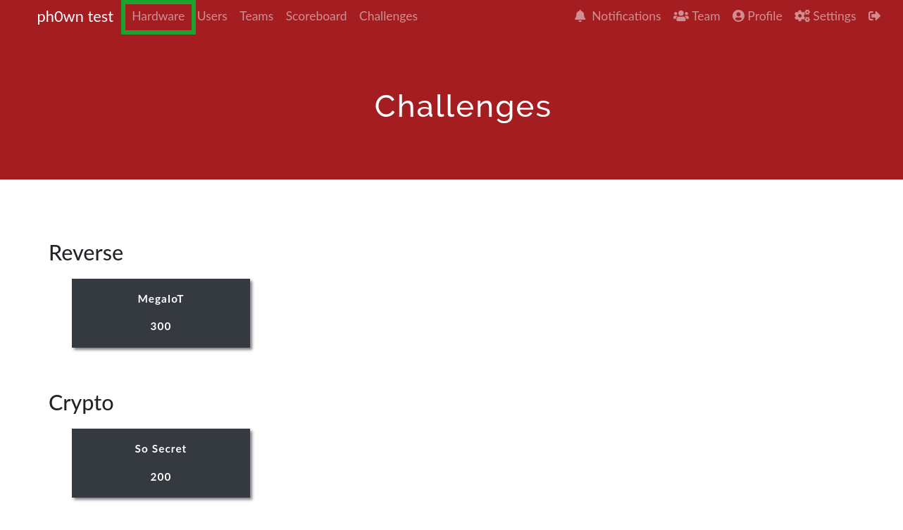
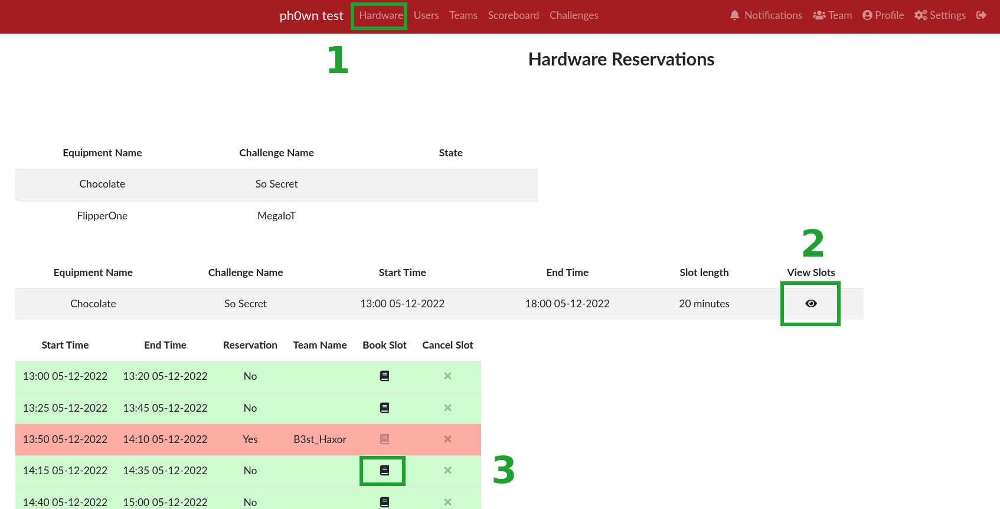
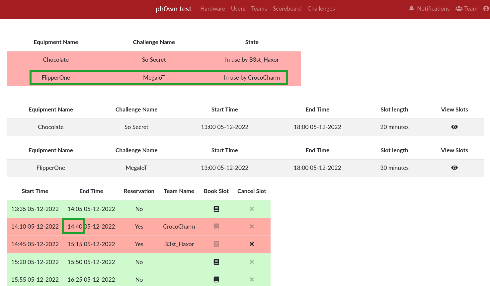
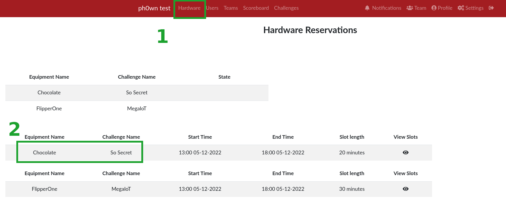
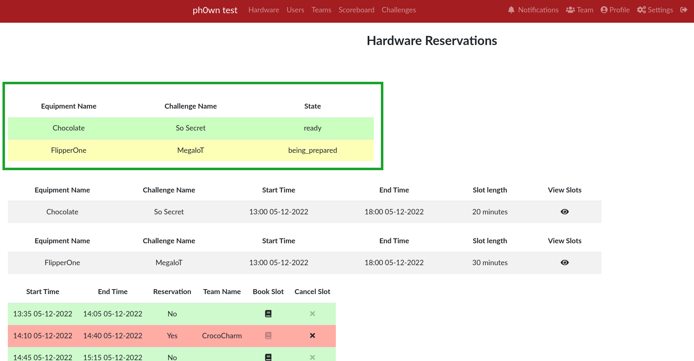

# Plugin

This plugin helps track equipment to lend to participants during a CTF.
It was used during Ph0wn 2022 and mostly coded by *Roman Suchwalko*.

# Terminology

For this plugin,

- A *hardware* or *equipment* is a device a team can borrow.
- A *time slot* is the given time for which a given team has the equipment for itself.
- A *reservation queue* is the list of all time slots for a given equipment.

# Hardware booking lifecycle

## Initial Setup

1. Create a reservation queue: log in as admin, Admin Panel > Plugins > Hardware monitoring. On the page, button "Create a reservation queue"

- The hours are in *AM/PM* mode
- There is automatically a *5-minute gap* between each slot. Those 5 minutes are configurable in the code in `utils.py create_queue()`

2. Prepare each hardware (clean it, check, reset...)
3. Mark them as "Ready". On the page, this is a Green button.

## Lifecycle during CTF

1. CTF team books a slot

- Hardware menu. Then view slots. Then Book Slot.

2. A member of the team comes to take the device

- They must notify an organizer

3. Organizer marks device "In Use"

- You need to go in the queue of the particular device for that:
- Admin Panel > Plugins > Hardware Monitoring.
- View slots
- Set In Use

4. Team brings back the device before the end of the slot

5. Organizer marks device "Being Prepared / Device Returned by Team"

- Orange button

6. Organizer resets, cleans, verifies the device

7. Organizer marks device "Ready to Lend". 

## Notifications

In the current state, teams do not know when a hardware is available to pick up.

It is possible to add a general notification, telling everybody that device XYZ is available.
See `__init__.py` `set_queue_state()`. The code is currently disabled: beware it may generate lots of notifications if there are many hardware.

# Troubleshooting

## A team does not bring back a device

1. Go and see them and get the device.
2. If you can't locate them, send a notification: Admin Panel > Notification
3. Call on the microphone.

If they don't come running back with the device:

1. Temporarily, remove a big amount of points (e.g -1000):  

    - Admin Panel > Teams.
    - Select the team
    - Click on the Cup: "Award Team Member"
    - Select a team member: the captain if possible, but it doesn't matter
    - Value: eg. `-1000 `
    - Description: "Bring XXX back now to recover your points!"
    - Icon: select an Angry icon :)

2. When they bring the device back, remove the fine:

    - Admin Panel > Teams.
    - Select the team
    - Awards: select the negative award
    - Delete

Then, to make the device available to other teams, read on "A team brings back the device late"

## A team brings back the device late

- Set it as "Being Prepared" and do what you need to do (clean, reset)
- Once this is done, click on "Delay Slots". This will delay all remaining slots for the equipment by the amount of minutes.
- Set the device as "Ready" when you can.

## A team is unable to cancel their slot

You can do it from :

- Admin Panel > Plugins > Hardware Monitoring
- Pick the line with the right hardware. View slots
- Cancel slot.

## Organizer clicked on "In Use" for the wrong team / wrong slot

- Simply click on the correct slot. It will erase the wrong team and replace by the one you select.

**Do not click on Cancel Slot**. This is to erase the slot.

## A team has booked a slot they didn't want

- They cancel their slot
- They book another slot

